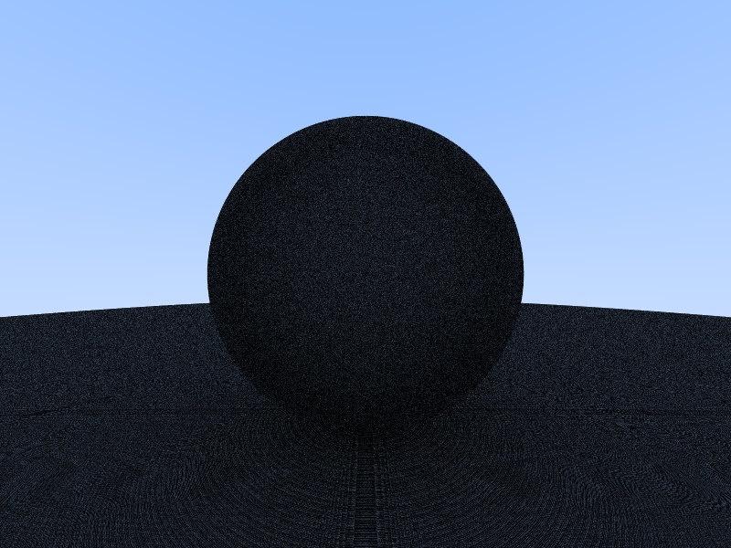

# Strange Circular Banding

[](images/strange-circular-banding.png)

The rendered image is also very dark. 

```rust
let limits = 0.0..Fp::MAX;
let intersection = sphere.ray_intercept(ray, &limits);
```

Because I set the lower limit to 0, `ray_intercept()` would return hit when `t` is 0. This causes
a sphere to intersect with a ray bounced from the sphere itself. This would lead to infinite
loop of successful intersection test on the sphere and its bounced ray, if the trace depth is not 
capped. Because the trace depth is capped, the trace would eventually return zero, abandoning the 
contribution of the original ray. That's why the rendered image is dark. I'm not exactly sure why
the circular banding, which is also fixed by setting the lower limits to a positive non-zero
value.

# Snell's Law

[](images/snell-law.jpg)

To calculate refracted ray $R^\prime = R^\prime_\perp + R^\prime_\parallel$:

$$
R_\parallel = (R \cdot n)n \\[3pt]
R_\perp = R - R_\parallel \\[3pt]
R_\perp^\prime = sin\theta^\prime |R^\prime|\dfrac{R_\perp}{|R_\perp|} \\[3pt]
\because |R^\prime| = |R| \\[3pt]
R^\prime_\perp = \dfrac{sin\theta^\prime |R^|}{|R_\perp|} R_\perp \\[3pt]
R^\prime_\perp = \dfrac{sin\theta^\prime}{sin\theta} R_\perp \\[3pt]
R^\prime_\perp = \dfrac{\eta}{\eta^\prime} (R - (R \cdot n)n) \\[3pt]
\because |R^\prime_\parallel|^2 = |R^\prime|^2 - |R^\prime_\perp|^2 \land |R^\prime| = |R| \\[3pt]
R^\prime_\parallel = \sqrt{|R|^2 - |R^\prime_\perp|^2} (-n)
$$

When calculating $R^\prime_\parallel$, the term $|R|^2 - |R^\prime_\perp|^2$ could be negative, 
which doesn't work wth square root (in this context). If we define $\dfrac{\eta}{\eta^\prime}$ as 
a constant greater than 1, because $\dfrac{\eta}{\eta^\prime}=\dfrac{sin\theta^\prime}{sin\theta}$,
when $\theta=90\degree$ $sin\theta^\prime$ is greater than 1, which can't happen. Physics says 
that after $sin\theta^\prime=1$, further increasing $sin\theta$ would cause
[total internal reflection](https://en.wikipedia.org/wiki/Total_internal_reflection).

